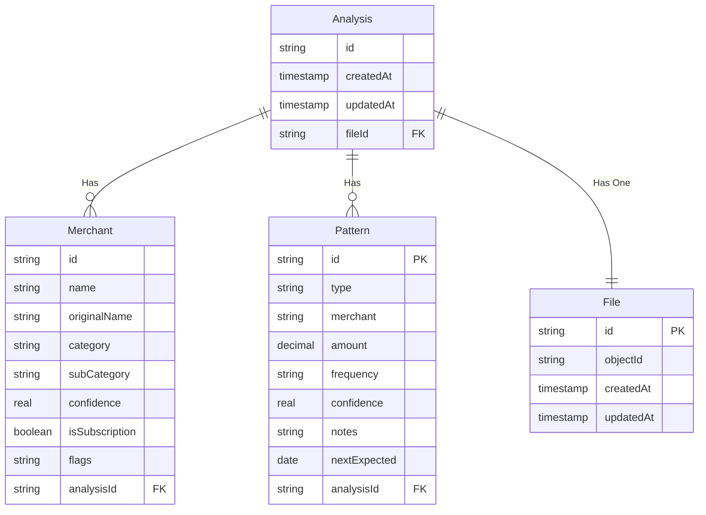

# Financial Transaction Analysis Service

## Introduction

The **Financial Transaction Analysis Service** is a core component of a AI-driven system designed for **merchant normalization and pattern detection** in financial transactions. This service specifically manages **user interactions**, providing functionalities such as **listing analysis history, initiating new analyses, handling file uploads, and managing analysis deletions**.

By integrating seamlessly with an external AI processing service, this module ensures a **structured and efficient workflow** while maintaining a clear separation of concerns. The AI-driven **merchant classification and pattern detection** are executed in a separate service, ensuring scalability and modularity.

### **Key Features**

- **Analysis Management**

  - List users' past analyses with metadata
  - Start a new transaction analysis
  - Delete outdated or irrelevant analyses

- **File Handling**

  - Upload transaction data files for analysis
  - Maintain associations between uploaded files and analyses

- **User-Centric Operations**
  - Provide a history of financial transaction analyses
  - Enable seamless interactions with the AI-powered processing system

This service acts as a **gateway for users** to interact with AI-driven financial insights, allowing them to track, manage, and derive value from their transaction history while keeping computation-heavy AI tasks in a dedicated, scalable backend.

## ERD



## Instructions

### Bringing up Docker containers

1. Ensure that Docker and Docker Compose are installed on your local machine.
2. Ensure to create `.env` by referencing to `.env.test` file variables. You will need to provide your own credentials.
3. In the root directory of the project run the following commands in the terminal to bring up the Docker containers:

```bash
docker-compose build
docker-compose up
```

These commands will initialize and start the containers defined in the `docker-compose.yml` file.

### Accessing Swagger UI

1. After seeding the database, open your browser and go to `http://localhost:8080/api-docs`.
2. This will open the Swagger UI, providing documentation and endpoints for the API.

### Using the API

**1. Upload a File**

- Open **Swagger UI** and locate the POST `/api/upload` endpoint.
- Generate an **S3 bucket URL** and an **ObjectID** for the file upload.

**2. Upload the File to S3**

- Use the generated URL to upload your file via a **PUT request**:

```cURL
curl --location --request PUT '<<generated_url>>' \
--header 'Content-Type: text/csv' \
--data-binary '@/Users/nuri/Desktop/sample-dataset.csv'
```

**3. Create a New Analysis**

- Use the generated ObjectID and send a POST request to `/api/analyse` to initiate a new analysis.

**4. Generate Normalized Merchant Data**

- Send a POST request to `/api/merchant` to retrieve the normalized merchant data.

**5. Generate Normalized Pattern Data**

- Send a POST request to `/api/patterns` to retrieve the normalized pattern data.

## Folder Structure

- src/

  - common/
    - errors
    - interceptors
    - validators
    - ...
  - config/
    - database.config.ts
    - swagger.config.ts
    - app.config.ts
    - ...
  - modules/
    - analysis/
      - analysis.entity.ts
      - analysis.repository.ts
      - analysis.controller.ts
      - analysis.service.ts
      - dto
        - create-analysis.dto.ts
        - delete-analysis.dto.ts
    - ...
  - providers/
    - postgres/
      - provider.module.ts
      - provider.service.ts
    - grpc-client/
      - provider.module.ts
      - provider.service.ts
    - ...

- **Common**: This directory contains common utilities and functionalities used across the application. It promotes code reusability and follows the DRY (Don't Repeat Yourself) principle. Organizing error handlers, interceptors, and validators here helps in maintaining consistency and reducing duplication of code.

- **Config**: Configuration files are centralized in this directory, making it easier to manage application settings. Separating configuration concerns from the rest of the codebase allows for easier modification and customization of settings without altering application logic. Additionally, having separate configuration files for different aspects of the application, such as database and Swagger, promotes modularity and clarity.

- **Modules**: Entities are organized into separate folders within the models directory, following a modular structure. Each entity folder contains files responsible for handling busines related operations for that entity: entity definition, repository, service, and controller. This organization pattern promotes separation of concerns and enhances maintainability by encapsulating related functionality within each entity.

- **Providers**: Connection-related logic, such as database connection handling, is centralized in this directory. Providers abstract away the details of establishing connections and managing configurations, making it easier to switch between different providers or configurations. This pattern follows the Dependency Injection principle, allowing for loose coupling and improved testability.

## Tests Overview

- **Purpose**: Tests focus on testing individual units of code such as services, helpers, functions, and classes in isolation.
- **Scope**: These tests ensure that each unit of code behaves as expected independently of its dependencies.
- **Examples**: Testing service methods, utility functions, and class methods with mocked dependencies.
